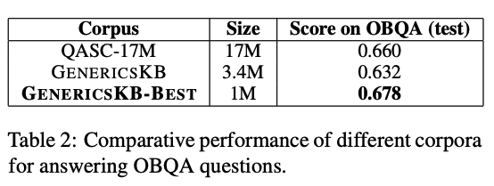
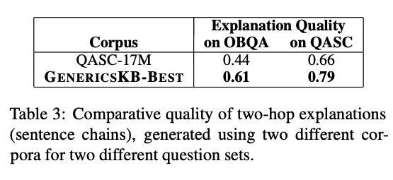

# ComFact: A Benchmark for Linking Contextual Commonsense Knowledge 
Paper: https://arxiv.org/pdf/2005.00660.pdf
Repo:  -
Data:  https://allenai.org/data/genericskb

## New terms

## Premise
* NLP researchers frequently seek out additional repositories of general / commonsense knowledge to boost performance further.

## Problem
* only limited number of data available in the wild.
* available datasets, like ConceptNet or WordNet, are not in a form of sentences.

## Dataset used

* OpenbookQA (Mihaylov et al., 2018), (https://huggingface.co/datasets/openbookqa)
* QASC-17M (Khot et al., 2019)

## Model used
* BERT-MCQ QA (MCQ=Multiple Choice Question)

## Results
* Slight increase in model performances.

* Significant increase in readability score (based on survey).

## Future works

## Sample data