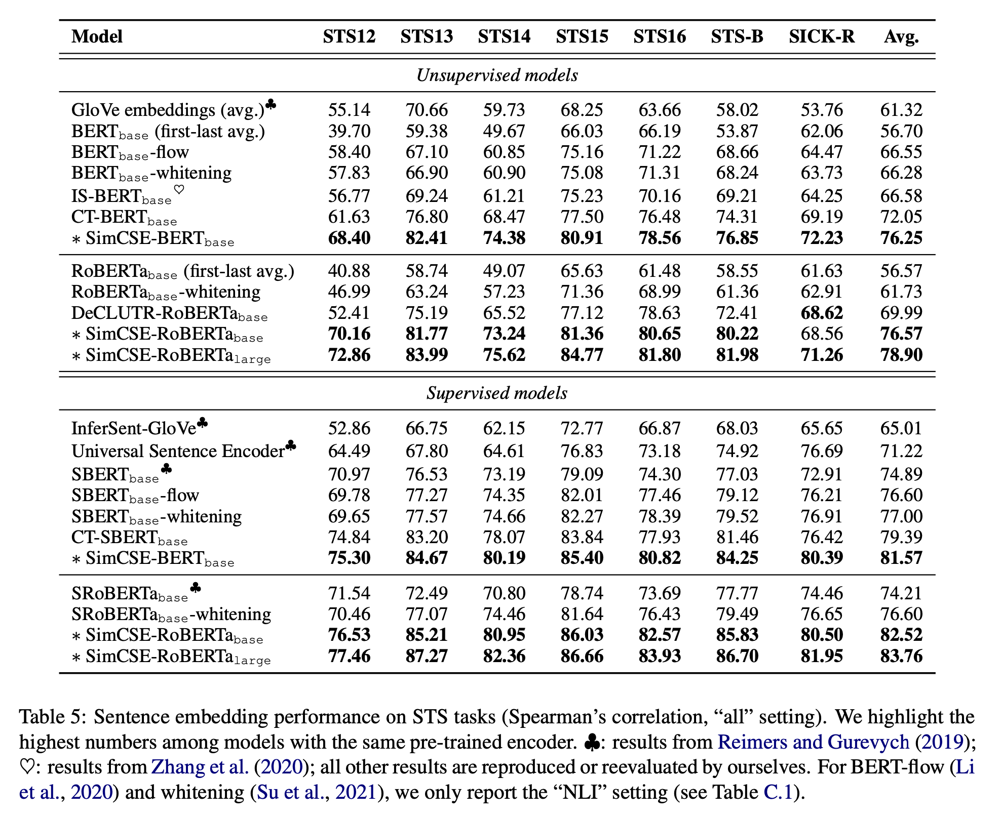

# SimCSE: Simple Contrastive Learning of Sentence Embeddings
Paper: https://aclanthology.org/2021.emnlp-main.552/

Repo:  https://github.com/princeton-nlp/SimCSE

Data: -

## New terms
* SimCSE

## Premise

## Problem
* How to apply contrastive learning in NLP.
* SimCSE
    * unsupervised: use same sentence $x_i$, and $x_i^+=x_i$. Both using same encoder $\text{enc}(x) = h$, but each one have different dropout. Or in other words, just feed the same sentence $x$ to the encoder with dropout -> this will make the encoder to produce different result anyway.
    * supervised: used NLI datasets to do contrastive learning. where the positive is the sentence labeled as *entailment* and the negatives are sentences labeled as the *contradiction*.

## Results

* supervised SimCSE wins, for STS task!
* unsupervised SimCSE may improve the LM performance in STS task. And could be cheap alternatives to improve downstream tasks?

## Future works
- 