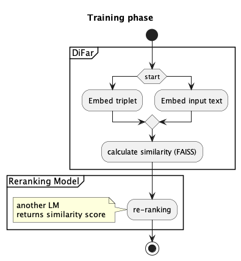

# ComFact: A Benchmark for Linking Contextual Commonsense Knowledge 
Paper: https://aclanthology.org/2023.acl-long.558.pdf
Repo:  -
Data:  

## New terms

## Premise
* The common approach to retrieve knowledge graph (KG) involve 3 steps: entity  span detection, entity disambiguation, relation classification. 
* Each of the step requires additional labels.
* full model for current fact retrieval
$$
    t^+ = \underset{t \isin G}{\operatorname{arg\ max}}\  p_{\theta}(t|e,x,G)\ p_{\phi}(e|m,x)\ p_{\psi}(m|x)
$$

* $p_{\theta}(t|e,x,G)$ is model of relation classification
* $p_{\phi}(e|m,x)$ is model of disambiguation
* $p_{\psi}(m|x)$ is model of mention detection

## Problem
* Can we skip the linking entity step ? and directly retrieve the facts?

## Methodology
* System architecture looks like this

## Results

## Future works

## Sample data

