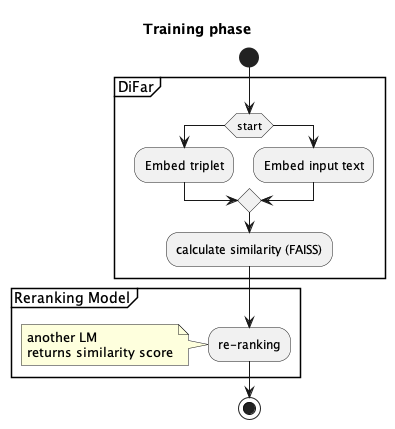
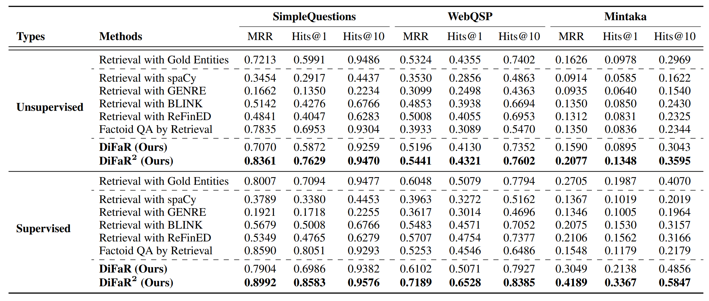
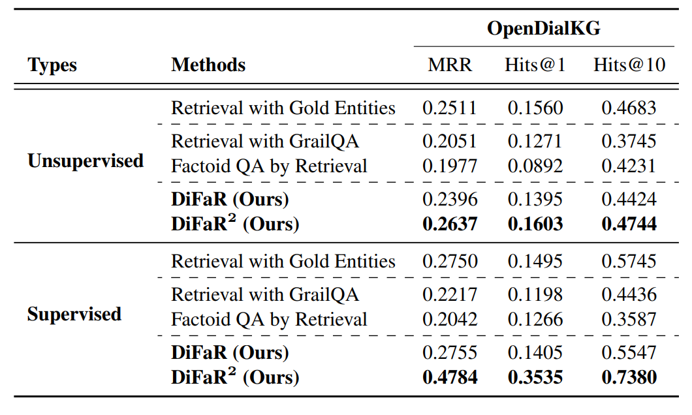
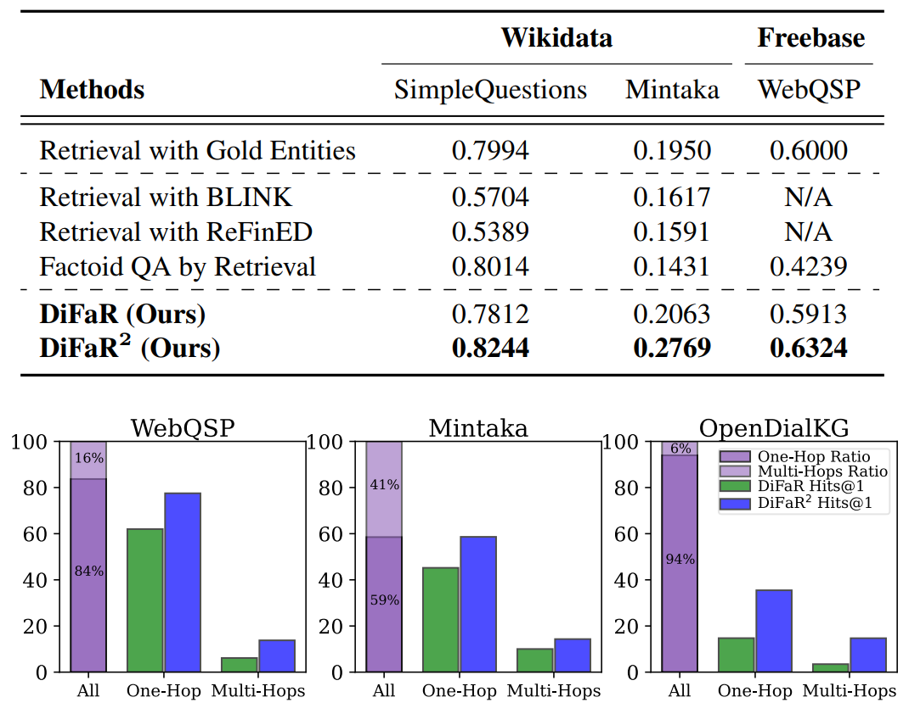

# ComFact: A Benchmark for Linking Contextual Commonsense Knowledge 
Paper: https://aclanthology.org/2023.acl-long.558.pdf

Repo:  -

Data:  

## New terms

## Premise
* The common approach to retrieve knowledge graph (KG) involve 3 steps: entity  span detection, entity disambiguation, relation classification. 
* Each of the step requires additional labels.
* full model for current fact retrieval
$$
    t^+ = \underset{t \isin G}{\operatorname{arg\ max}}\  p_{\theta}(t|e,x,G)\ p_{\phi}(e|m,x)\ p_{\psi}(m|x)
$$

* $p_{\theta}(t|e,x,G)$ is model of relation classification
* $p_{\phi}(e|m,x)$ is model of disambiguation
* $p_{\psi}(m|x)$ is model of mention detection

## Problem
* Can we skip the linking entity step ? and directly retrieve the facts?

## Methodology
* System architecture looks like this

* Datasets used
    * QA
        * SimpleQuestions (Bordes et al. 2015)
            * https://github.com/davidgolub/SimpleQA/tree/master/datasets/SimpleQuestions
            * https://huggingface.co/datasets/simple_questions_v2
            * Format: `Subject-entity [tab] relationship [tab] Object-entity [tab] question`
        * WebQuestionsSP (Berant et al., 2013)
        * Mintaka (Sen et al., 2008)
    * Dialogue
        * OpenDialKG (Moon et al., 2019)
    * Knowledge Graph
        * Wikidata KG  (Vrandecic and Krötzsch, 2014) -> for QA
        * Freebase -> Dialogue

* Model used: DistilBERT
    * pretrained with MSMARCO dataset (Nguyen et al., 2016)

## Results

* Measurements:
    * Hits@K: weather the retrieved Top-K triplets include a correct answer
    * MRR (Mean Reciprocal Rank): Measure the rank of the first correct triplet for each input text, then computes the average of reciprocal ranks of all results

* QA Result

* Dialogue Result

* Zero-shot transfer learning result

* DiFar can handle multi-hops too

## Future works
* Performance improvements on complex dataset: WebQSP, Mintaka
* Maybe:
    * model triplets over KG's graph structures, esp to blend KG's representation with LM's representation, thus generating more effective search space.
    * more languages to be tried.

    

## Sample data

