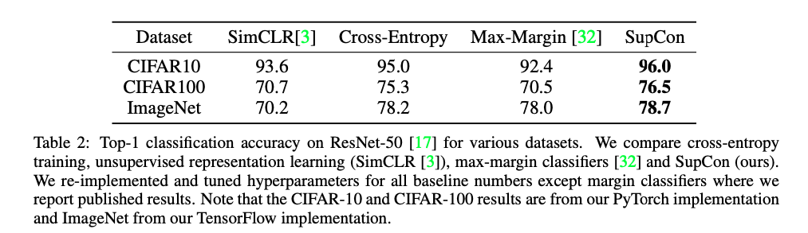

# Supervised contrastive learning 
Paper: https://proceedings.neurips.cc/paper/2020/file/d89a66c7c80a29b1bdbab0f2a1a94af8-Paper.pdf
Repo:  https://github.com/HobbitLong/SupContrast
Data: -

## New terms
* self-supervised contrastive learning.
* supervised contrastive learning.
* contrastive embedding.
* Compact Clustering via Label Propagation (CCLP) regularizer.

## Premise
* self-supervised contrastive learning is using one positive per "anchor", compared to many negatives.
* if we translate this into supervised learning, then we will include many positives per "anchor".

## Problem
$$
\newcommand{\Lagr}{\mathcal{L}}
$$
* how do we ensure the model learn given many positives per "anchor"?
    * introduce new loss function **SupCon**. 
    * $\Lagr{^{sup}_\text{out}}$
    $$
        \Lagr{^{sup}_\text{out}} = \sum_{i \in I}\frac{-1}{|P(i)|}\sum_{i \in I}{\space\text{log} \frac{\text{exp}(z_i.z_p/\tau)}{\sum_{a \in A(i)}\text{exp}(z_i.z_a/\tau)}}
    $$

    * $\Lagr{^{sup}_\text{in}}$
    
    $$
    \Lagr{^{sup}_\text{in}} = 
        
        \sum_{i \in I} - \text{log} 
        \left\{ 
            \frac{1}{|P(i)|}
            \sum_{p \in P(i)} \frac{\text{exp} (z_i.z_p / \tau)}{\sum_{a \in A(i)}\text{exp} (z_i.z_a / \tau)}
        \right\}
        
    $$
    where:
    * $z$ is $Proj(Enc(x))$
    * $i$ is index of an aribitrary augmented sample.
    * $P(i)$ set of indices of all positives.

## Results

### Classification accuracy

## Future works
- 